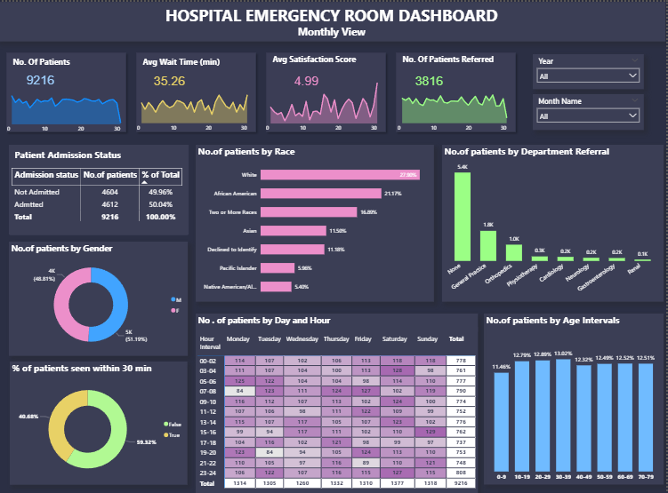

# Hospital-Emergency-Room-Analysis-Using-PowerBI

### 🎯Objective

The objective of this project is to analyze hospital emergency room data using Power BI to monitor patient flow, evaluate wait times, and identify patterns in patient demographics and department referrals to support operational efficiency and better healthcare decision-making.

---

### 📌Project Workflow
* Data Collection
* Imported the dataset into Power BI
* Data Cleaning and Transformation using Power Query
* Dax Calculations for analysis
* Interactive Dashboard Development

---

### 📁About Dataset
The dataset contained about 9.2k+ patients records.

Columns Included:
   - Patient Id
   - Patient Admission
   - Date
   - Patient First Inital
   - Patient Last Name
   - Patient Gender
   - Patient Age
   - Patient Race
   - Department Referral
   - Patient Admission Flag
   - Patient Satisfaction Score
   - Patient Waittime
   - Patients CM

---

### ⚙Data Cleaning and Transformation
* Handled Null Values
* Ensured no duplications
* Changed data types
* Merged patient's name column
* Renamed column names

---

### 📝Dax Calculations

- Derived patient admission status using **IF** to classify admitted and non-admitted patients.
- Created age interval groups with **SWITCH** to analyze patient distribution across different age ranges.
- Calculated key KPIs such as average patient wait time and average satisfaction score using AVERAGE.
- Extracted admission hour from timestamps with **HOUR** for time-based analysis.
- Grouped admission hours into intervals using **SWITCH** to study patient arrival patterns.
- Measured the number of patients referred to other departments using **CALCULATE** and **COUNTROWS**.
- Computed the total number of unique patients using **DISTINCTCOUNT**.
- Standardized the patient admission date using **DATE**, **YEAR**, **MONTH**, and **DAY** functions.
- Categorized wait time performance using IF based on a 30-minute service benchmark.
- Generated a calendar table with **CALENDAR** and **ADDCOLUMNS** to enable year, month, and weekday analysis.

---

### 📊Dashboard Development

Visualization Includes:

- KPI Cards with sparklines displaying key metrics such as total number of patients, average wait time, average satisfaction score, and number of patients referred.
- Bar charts illustrating patient distribution by race and department referrals.
- Donut charts showing patient distribution by gender and the percentage of patients seen within 30 minutes.
- Stacked bar chart summarizing patient admission status (admitted vs not admitted).
- Heatmap matrix visualizing patient visits by day of the week and hourly intervals.
- Column chart presenting the distribution of patients across different age groups.
- Interactive slicers for filtering the dashboard by year and month.

### 📉Dashboard Preview:

---

### 🔎Key Insights

- The emergency room handled 9,216 total patient visits during the analyzed period.
- The average patient wait time was 35.26 minutes, slightly above the 30-minute service benchmark.
- The average patient satisfaction score was 4.99, indicating generally positive patient experience.
- Patient admissions were nearly evenly split, with about 50% admitted and 50% not admitted.
- General Practice and Orthopedics received the highest number of referrals.
- Male and female patient visits were almost evenly distributed, showing balanced gender representation.
- Most patients arrived during midday and afternoon hours, indicating peak emergency room demand during these periods.
- Patient visits were relatively evenly distributed across age groups, with slightly higher volumes among adults between 20–39 years.
- White and African American patients represented the largest proportion of emergency room visits in the dataset.
- Slightly more than half of the patients were seen within the 30-minute target wait time.

---

### 💡Recommendations

- Reduce patient wait time by adding more staff during busy hours when more patients arrive.
- Improve the patient checking process at arrival so patients can be examined and treated faster.
- Work closely with departments like General Practice and Orthopedics since many patients are referred there.
- Track wait times regularly to make sure most patients are seen within 30 minutes.
- Improve patient experience by reviewing satisfaction scores and identifying areas that need improvement.
- Use patient data such as age and visit patterns to plan staff schedules and hospital resources better.

